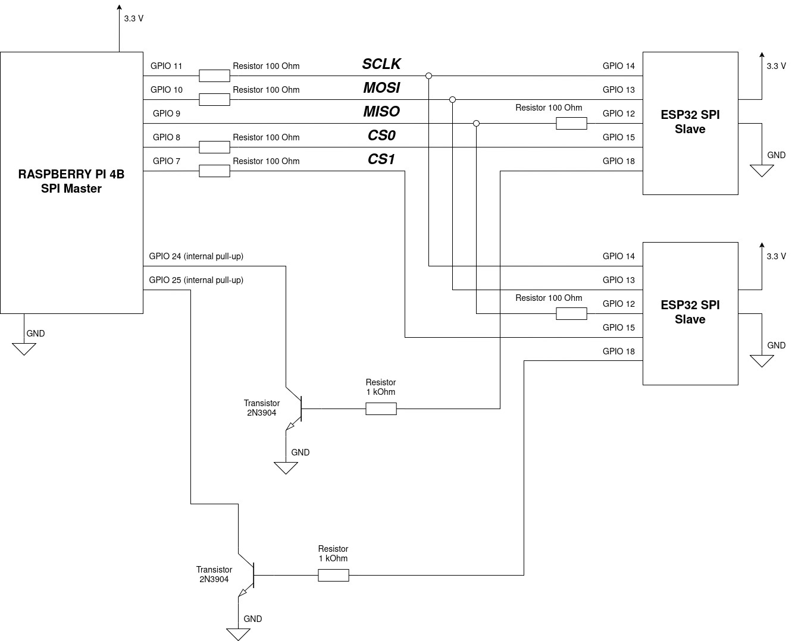

# SHA256 calculator

This is a simple project that connects a Raspberry Pi 4B (controller) to a group of ESP32 microcontrollers (workers). The Raspberry Pi generates a SHA256 digest which it sends to the group of ESP32 microcontrollers via a communication protocol. It also sends a mask value, an offset and a puzzle ID (totalling 38 bytes).

```
|OFFSET (4 bytes)|MASK (1 byte)|SHA256 digest (32 bytes)|PUZZLE_ID (1 byte)|
```

Each ESP32 takes the parameters and starts calculating for a solution. They take the offset, hash it (SHA256) and compare the masked portions of both digests (the one received from Raspberry Pi and the one generated from the current offset). They do this until the masked portions match and in case that happens for one ESP32, that ESP32 sends an interrupt to the Raspberry Pi which will then read the current offset (the solution itself) and the puzzle ID from the corresponding ESP32.

```
|OFFSET SOLUTION (4 bytes)|PUZZLE_ID (1 byte)|
```

The *mask* value defines how many bits of the digests should be taken for comparison (from the beginning of the digests). The number ranges from 0 (only the first bit - 1 bit) to 255 (whole digest - 256 bits).

The *offset* defines the starting number from which each ESP32 will start its search for a solution. It's an unsigned 4 byte number.

The *solution* is the offset for which the masked portions matched (also 4 bytes).

The *puzzle_id* identifies the offset solution to the corresponding inputs. It makes the Raspberry Pi know which solution belongs to which inputs.

## Schematic - I2C variant

Both Raspberry Pi and ESP32 microcontrollers operate at 3.3V logic levels. No logic level shifter is needed for I2C or GPIO connections.


## Schematic - SPI variant

Both Raspberry Pi and ESP32 microcontrollers operate at 3.3V logic levels. No logic level shifter is needed for SPI or GPIO connections.


